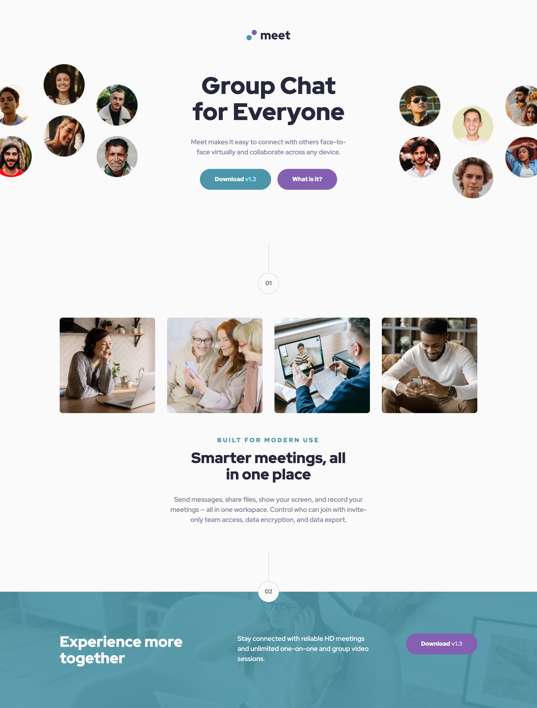

# Frontend Mentor - Meet landing page solution

This is a solution to the [Meet landing page challenge on Frontend Mentor](https://www.frontendmentor.io/challenges/meet-landing-page-rbTDS6OUR). Frontend Mentor challenges help you improve your coding skills by building realistic projects.

## Table of contents

- [Overview](#overview)
  - [The challenge](#the-challenge)
  - [Screenshots](#screenshot)
  - [Links](#links)
- [My process](#my-process)
  - [Built with](#built-with)
  - [What I learned](#what-i-learned)
  - [Continued development](#continued-development)
  - [Useful resources](#useful-resources)
- [Author](#author)

## Overview

### The challenge

Users should be able to:

- View the optimal layout depending on their device's screen size
- See hover states for interactive elements

### Screenshots

|        Mobile designed at 375px:         |        Tablet designed at 768px:         |        Desktop designed at 1440px:        |
| :--------------------------------------: | :--------------------------------------: | :---------------------------------------: |
|  |  |  |

### Links

- Solution URL: [https://github.com/elisilk/meet-landing-page](https://github.com/elisilk/meet-landing-page)
- Live Site URL: [https://elisilk.github.io/meet-landing-page/](https://elisilk.github.io/meet-landing-page/)

## My process

### Built with

- Semantic HTML5 markup
- CSS custom properties
- Flexbox
- CSS Grid
- Mobile-first workflow

### What I learned

- how to structure the HTML - what is the header? footer? sections?
- how to position the hero image
- [Drawing Decorative Lines With CSS](https://pqina.nl/blog/drawing-decorative-lines-with-css/) - how to make the numbered sections with the circle and vertical line

### Continued development

Hmm 🤔

### Useful resources

- [MDN Web Docs](https://developer.mozilla.org/en-US/) - Amazing, as always.

## Author

- Website - [Eli Silk](https://github.com/elisilk)
- Frontend Mentor - [@elisilk](https://www.frontendmentor.io/profile/elisilk)
